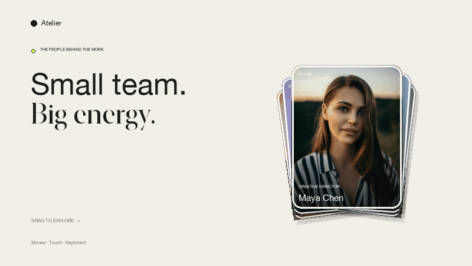

# Draggable Card Stack

A responsive, GSAP-powered card stack for presenting a team, product features, services, or portfolio work.

> 一个使用 GSAP 构建的响应式卡片堆叠交互，适合展示团队成员、产品功能、服务或作品。

## Live demo

[Open the interactive GitHub Pages preview →](https://jdb156158.github.io/DraggableCardStack/)

[](https://jdb156158.github.io/DraggableCardStack/)

## Features

- Drag or swipe the front card in either direction.
- The released card visibly moves behind the stack instead of disappearing.
- Cards advance with coordinated GSAP transitions.
- Mouse, touch, and keyboard interaction.
- Responsive desktop and mobile layouts.
- Keyboard focus and reduced-motion-friendly markup.
- No build step or framework required.

## How the interaction works

The front card follows the active pointer using Pointer Events. While it moves, the cards behind it progressively expand toward their next positions. Releasing beyond the distance or velocity threshold triggers a two-part GSAP animation:

1. The selected card moves to the side of the stack.
2. Its stacking order changes and it slides visibly into the final position.
3. The remaining cards move forward together.

Releasing before the threshold returns the card with an elastic spring animation.

## Tech stack

| Technology | Purpose |
| --- | --- |
| HTML5 | Semantic card and page structure |
| CSS3 | Responsive layout, card styling, and accessibility states |
| JavaScript | Pointer, touch, and keyboard interaction state |
| [GSAP 3](https://gsap.com/) | Entry, drag response, spring, and stack-reordering animation |
| Pointer Events | Unified mouse and touch input |

## Run locally

No dependency installation is required. Start any static file server from the project directory:

```bash
python3 -m http.server 4173
```

Then open [http://localhost:4173](http://localhost:4173).

## Controls

- **Mouse / touch:** drag the front card left or right.
- **Release past the threshold:** move the card to the back.
- **Release early:** return the card to its starting position.
- **Keyboard:** focus the front card and use the left or right arrow key.

## Project structure

```text
.
├── index.html                     # Page content and card data
├── styles.css                     # Layout and visual design
├── app.js                         # Dragging and GSAP animation logic
├── docs/assets/                   # README media
├── scripts/build_demo_gif.py      # Rebuilds the interaction preview
├── LICENSE
└── README.md
```

## Customization

Edit the `.profile-card` elements in `index.html` to replace names, roles, and portraits. Card dimensions, colors, spacing, border radius, and responsive breakpoints are defined near the top of `styles.css`. Stack movement is controlled by `baseRotations`, `baseX`, and `baseY` in `app.js`.

## Rebuild the GIF

The preview generator requires Python 3 and Pillow:

```bash
python3 -m pip install Pillow
python3 scripts/build_demo_gif.py
```

## Contributing

Issues and pull requests are welcome. Keep changes focused, preserve mouse/touch parity, and test both a desktop viewport and a narrow mobile viewport before submitting.

## Image attribution

The demo portraits are loaded from [Unsplash](https://unsplash.com/). They are not covered by this repository's MIT license; review Unsplash's current license before redistributing the imagery separately.

## License

Released under the [MIT License](LICENSE).
